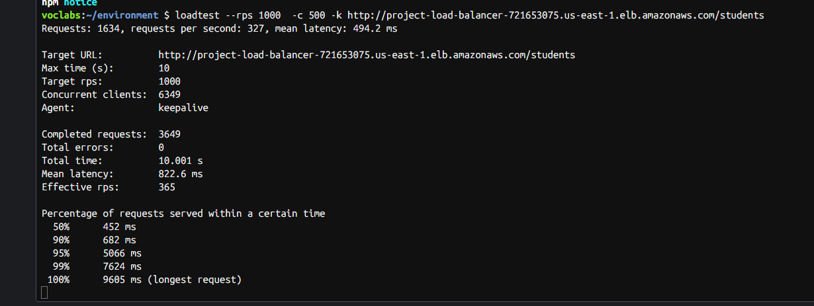

# DevOps Engineering on AWS Cloud - Project 2025

## Project Title: Building a Highly Available, Scalable Web Application

## Authors:

- Luka Bartula
- Mirna Ljiljić
- Nora Žehak
- Harun Musa

---

## Repository Description

This repository contains the full step-by-step reproducible guide for completing the AWS Academy "Highly Available, Scalable Web Application" project. It follows AWS Academy labs best practices, designed to allow any student to repeat the project entirely inside AWS Cloud using AWS Console and Cloud9 only.

---

## Repository Structure

```
├── application-code/
│   └── (your app source code)
│
├── docs/
│   ├── AWS Cost Estimate.pdf
│   ├── load-testing.png
│   ├── WebApp.drawio.png
|   └── ime prezentacije . pptx
│
├── helper-scripts/
│   ├── phase2/
│   │   └── ec2-setup.sh
│   ├── phase3/
│   │   ├── cloud9-scripts.yml
│   │   └── UserdataScript-phase3.sh
│   └── phase4/
│       └── cloud9-scripts.yml
│
└── README.md
```

---

# STEP-BY-STEP PROJECT GUIDE

---

## PHASE 1 — PLANNING AND COST ESTIMATION

### Step 1: Create Architecture Diagram

- Use **Lucidchart** or **Draw\.io** (AWS Architecture Icons library)
- Include:
  - VPC (public/private subnets)
  - EC2 instances
  - RDS
  - Application Load Balancer
  - NAT Gateway
  - Secrets Manager
- Export diagram as PDF or PNG

### Step 2: Create Cost Estimate

- Use **AWS Pricing Calculator**
- Add:
  - 2 EC2 instances (t2.micro)
  - RDS MySQL (db.t3.micro)
  - Application Load Balancer
  - NAT Gateway
  - Secrets Manager
- Export estimate as PDF

> *Sample estimates provided in **`docs/AWS Cost Estimate Worksheet.pdf`** from this project.*

---

## PHASE 2 — INITIAL FUNCTIONAL DEPLOYMENT

### Step 3: Create EC2 Instance (First Instance)

- Launch EC2 instance (t3.medium) in default VPC (for now)
- AMI: Ubuntu Server 22.04 LTS
- Enable public IP
- Security Group: Allow HTTP (80), MySQL/Aurora(3306)

### Step 4: Attach EC2 User Data (Automated Setup)

- Paste the provided **ec2-setup.sh** content into EC2 User Data field during instance creation.
- File location: `helper-scripts/ec2-setup.sh`
- This script will:
  - Install Node.js, MySQL, unzip, wget
  - Download application code
  - Install dependencies
  - Configure MySQL database and user
  - Create database schema and tables
  - Start the Node.js application

> ⚠ No manual SSH connection required.

### Step 5: Verify Deployment

- Access public IP of EC2 instance via browser to verify app is running.
- App should be accessible at `http://<EC2 Public IP>/students`, displays list of students

---

## PHASE 3 — DECOUPLING THE APPLICATION COMPONENTS

### Step 6: Create VPC and Subnets

- Use VPC Wizard (or manually):
  - Create new VPC
  - Create 2 public subnets (for Load Balancer)
  - Create 2 private subnets (for EC2 app servers & RDS)
  - Attach NAT Gateway for private subnets outbound internet

### Step 7: Create RDS MySQL Database

- Open Amazon RDS > Create Database
  - Engine: MySQL
  - Instance type: db.t3.micro
  - Storage: 20 GiB GP2
  - Availability Zone: Multi AZ
  - Set username and password
- Save endpoint address (used later)

### Step 8: Migrate Database to RDS (Via Cloud9)

- Launch **Cloud9 environment** in public subnet.
- Open Cloud9 terminal.
- Follow migration commands from `helper-scripts/cloud9-scripts.yml`
  - Export database from EC2 (private IP)
  - Import into RDS using endpoint

### Step 9: Create Secrets in AWS Secrets Manager

- Open Cloud9 terminal.
- Run provided secret creation command from `helper-scripts/cloud9-scripts.yml`
- Replace placeholders with actual values.
- Store DB username, password, endpoint, and db name securely.

### Step 10: Launch EC2 in Private Subnet

- Launch new EC2 instance (same AMI & type) in private subnet.
- Use **same User Data script (ec2-setup.sh)** to automatically configure app.
- Replace MySQL references to point to RDS instance.
- App now connects to RDS through internal networking.

---

## PHASE 4 — HIGH AVAILABILITY AND SCALABILITY

### Step 11: Create Application Load Balancer (ALB)

- Go to EC2 > Load Balancers > Create Load Balancer
  - Type: Application Load Balancer
  - Attach public subnets
  - Create Target Group with your private EC2 instances
  - Security Group: Allow HTTP (80)

### Step 12: Create Auto Scaling Group

- Create Launch Template using your private EC2 instance config
- Create Auto Scaling Group:
  - Attach to Load Balancer Target Group
  - Set minimum/maximum EC2 count

### Step 13: Load Testing

- In Cloud9 terminal, run load testing commands from `helper-scripts/cloud9-scripts.yml`, which are:
- Install loadtest package:

```bash
sudo npm install -g loadtest
```

- Execute load testing:

```bash
loadtest --rps 1000  -c 500 -k http://<LoadBalancer-DNS>/students
```



### Step 14: Verify Full Solution

- Confirm Auto Scaling works
- Confirm Load Balancer works
- Confirm Database is properly decoupled
- Confirm Secrets Manager integration

---

## GITHUB WORKFLOW

- Branches:
  - `main`: final submission
  - `develop`: working branch
- All diagrams, scripts, and documentation are versioned.

---

## PRESENTATION CHECKLIST

- Business Scenario
- Solution Architecture (Diagrams)
- Live Demo
- Load Testing Results
- Lessons Learned
- Cost Optimization

---

## AWS BEST PRACTICES COVERED

- High Availability with ALB & ASG
- Decoupled Web & DB layers
- Secure credential management with Secrets Manager
- Cost estimation and optimization
- Full reproducibility with provided documentation


